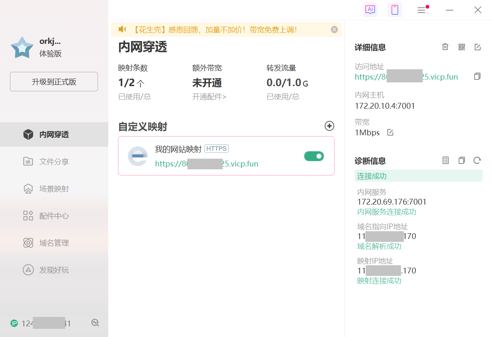

# Tiny Bridge --- Chat Pool

# 在Windows子系统WSL（Linux）中用C++搭建简单聊天服务器


# 项目简介

支持多用户在线实时聊天，消息通过服务器高效转发，确保所有用户同步接收最新聊天内容。

**HTTP服务器**
采用C++实现，支持处理常见的HTTP请求（如GET、POST），能够解析浏览器请求并生成对应的HTTP响应，确保与客户端的高效交互。
实现日志的写入，方便HTTP服务器调试。

**进程间通信**
通过进程套接字（IPC Socket）实现服务器与事务处理模块之间的高效通信，确保数据传递的可靠性与实时性。

**前端页面**
提供简易的聊天页面，用户可以通过浏览器访问并参与聊天。

**网络**
通过配置WSL镜像网络，并结合内网穿透技术，实现外网对本地服务的无缝访问，确保聊天服务器能够在广域网中正常运行。

# 项目结构

|—— include
|    |—— 头文件（.h 文件）
|—— src
|    |—— httpd
|    |    |—— 处理 HTTP 请求的源代码文件
|    |—— message
|    |    |—— 实现简单的类似 JSON 功能的源代码文件
|    |—— transaction
|    |    |—— 事务处理的源代码文件
|—— CMakeLists.txt
|—— build
|    |—— httpd
|    |    |—— index.html
|—— .clang-format

# 运行说明

1. 进入 build 目录

   在项目根目录下执行以下命令：

   ```shell
   cd build
   ```

2. 生成构建文件

   使用 cmake 生成构建文件：

   ```shell
   cmake ..
   ```

3. 编译项目

   使用 make 编译项目：

   ```shell
   make
   ```

​	此时在build目录下出现HTTPD和transaction两个可执行程序。

4. 启动事务处理服务器（源码中设置运行在7002端口）

   在 build 目录下运行事务处理服务器：

   ```shell
   ./transaction
   ```

5. 运行HTTP 服务

   在 build 目录下启动 HTTP 服务器（源码中设置运行在7001端口）：

   ```shell
   ./HTTPD
   ```

6. 启动HTTP服务

   ```shell
   twh@TWH:~/TinyBridge/build$ ./HTTPD 
   -------------------------------------------
   | Command List:                           |
   | 1. start        - Start the server      |
   | 2. stop         - Stop the server       |
   | 3. exit         - Exit the console      |
   -------------------------------------------
   Enter command: start
   Starting server on port 7001...
   -------------------------------------------
   | Command List:                           |
   | 1. start        - Start the server      |
   | 2. stop         - Stop the server       |
   | 3. exit         - Exit the console      |
   -------------------------------------------
   Enter command: stop
   Stopping server on port 7001...
   -------------------------------------------
   | Command List:                           |
   | 1. start        - Start the server      |
   | 2. stop         - Stop the server       |
   | 3. exit         - Exit the console      |
   -------------------------------------------
   Enter command: exit
   Exiting console...
   ```

7. 打开wsl setting设置Windows子系统wsl的网络模式为镜像

   

   

   此时wsl与Windows便共用一个IP地址。

8. 此时在浏览器输入http://localhost:7001/便可以访问网页

   其他设备在浏览器输入`[主机IP]:7001`也可以访问网页。

   但此时由于我们使用的不是公网IP，所以如果分享给不在我们局域网内的小伙伴，则会访问不到。申请公网IP比较麻烦，而使用**内网穿透技术**可以简单实现公网访问。

9. 查看HTTP服务器日志

   

# 内网穿透

我使用的是[贝锐花生壳内网穿透|ddns动态域名解析|端口映射工具-贝锐花生壳官网](https://hsk.oray.com/)来进行内网穿透的。

将主机IP映射到分配的网站域名即可实现公网访问。



# 异常处理

## wsl网络设置

[新版 WSL2 2.0 设置 Windows 和 WSL 镜像网络教程_wsl网络设置-CSDN博客](https://blog.csdn.net/Magicamazing/article/details/143505036)

## 端口阻塞

建议在退出HTTP服务器控制台之前先执行`stop`命令关闭TCP套接字。

```shell
twh@TWH:~/TinyBridge/build$ ./transaction 
terminate called after throwing an instance of 'std::runtime_error'
  what():  Failed to bind socket
Aborted (core dumped)
```

使用 `lsof` 和 `kill` 命令

1. **查找占用端口的进程**  
   使用 `lsof` 命令查找占用指定端口的进程：

   ```bash
   lsof -i :端口号
   ```

   例如，查找占用端口 `8080` 的进程：

   ```bash
   lsof -i :8080
   ```

   输出示例：

   ```
   COMMAND   PID USER   FD   TYPE DEVICE SIZE/OFF NODE NAME
   node    12345  user   20u  IPv6 123456      0t0  TCP *:http-alt (LISTEN)
   ```

   其中，`PID` 是进程 ID。

2. **杀死进程**  
   使用 `kill` 命令杀死进程：

   ```bash
   kill -9 PID
   ```

   例如，杀死 PID 为 `12345` 的进程：

   ```bash
   kill -9 12345
   ```

3. **强制杀死进程（如果 `kill` 无效）**  
   如果 `kill` 命令无效，可以尝试强制杀死进程：

   ```bash
   kill -9 $(lsof -t -i :端口号)
   ```

   例如，强制杀死占用端口 `8080` 的进程：

   ```bash
   kill -9 $(lsof -t -i :8080)
   ```

# 其他

此项目是本人在学习计算机网络的时候突发奇想构建的，整体比较简洁，欢迎大家多多提建议。